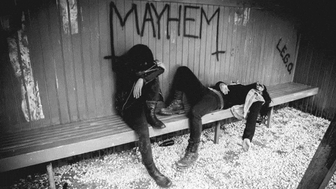

<h1 align="center">Hi there, I'm Vinuxx 👋</h1>

  

  

  

---

<h2 align="center">🌟 About Me</h2>

<table align="center" width="100%" border="0" cellpadding="8" cellspacing="0">
  <tr>
    <!-- Kolom Kiri: Tentang Saya -->
    <td valign="top" align="center" width="50%">
      <em>
        👋 Hi, I'm Leo! 
        🚀 Self-taught developer passionate about Laravel, Flutter, and exploring new tech. 
        🎸 Music fuels my creativity — especially dark, atmospheric, and heavy genres like NU metal & DSBM. 
        ☕ I thrive on iced coffee and loud riffs while coding. 
        🤝 Always open to collaboration, learning, and tackling new challenges!
      </em>
    </td>
    <td valign="top" align="center" width="50%">
      <h5>🎧 Now Playing</h5>
      
      <h5>🕑 Recently Played</h5>
      
    </td>
  </tr>
</table>

## 
<h2 align="center">🛠️ Tech Stack & Tools</h2>

  
  
  
  
  
  
  
  
  

---

<h2 align="center">📈 GitHub Stats</h2>

  
  

  

---

<h2 align="center">🌐 Connect with Me</h2>

  
  
  
  
  
  

---

<h2 align="center">📸 Gallery</h2>

<table align="center">
  <tr>
    <td></td>
    <td></td>
    <td></td>
  </tr>
  <tr>
    <td></td>
    <td></td>
    <td></td>
  </tr>
</table>

---

<h2 align="center">📌 Quote of the Day</h2>

  <em>"Learning isn't always easy, but every small step is progress. Keep going!"</em>

---

<b>Thank you for visiting 🙏</b>

